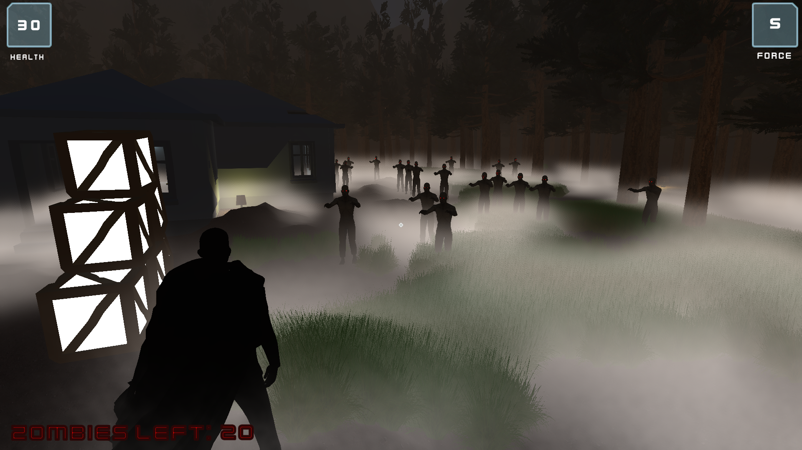
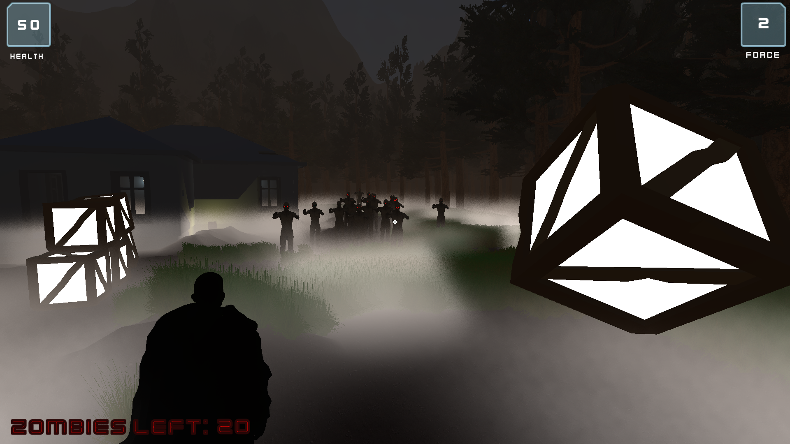
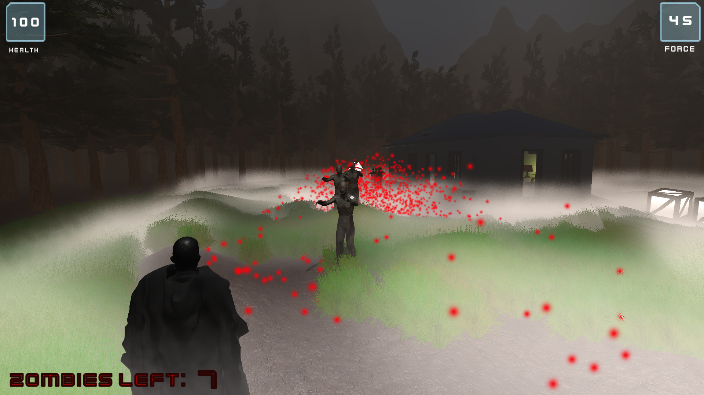

# Killing-Ground
### I made an Action horror 3D game in Unity. 
Inspired by games like Control & BioShock, I have implemented the special power of telekinesis in this game to defend ourself against hordes of enemies by throwing objects from the environment at them.

# ScreenShots

 &nbsp&nbsp&nbsp&nbsp

 &nbsp&nbsp&nbsp&nbsp

 &nbsp&nbsp&nbsp&nbsp

### Implementation Details & Design Patterns Used 
* **Implemented Telekinesis as a special power for pulling objects from the environment and throwing them on enemies.**
* **Implemented Singleton Pattern using a Generic Singleton Script for various Services**
* **Used Observer Pattern for various events like Player Death**
* **Implemented an enemy AI using Unity's NavMesh system and health system along with a random Enemy Spawner**
* **Used Particle Effects and multiple types of Light Sources in the game**

### Demo Link
You can have a look at the project demo here below:  
Game Demo:   https://youtu.be/2_KJBqclUGM

